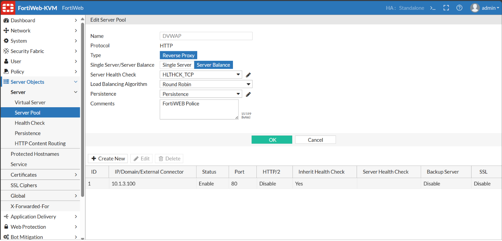

## SDN + WAF - Primera Capa de Seguridad
description: Guía de Configuración para equipos de seguridad en aplicaciones WEB de la marca Fortinet.

Esta guía presenta las configuraciones de seguridad que se deben realizar dentro de un equipo FortiWEB V7.6, orientadas a la seguridad mínima que deben tener las aplicaciones WEB dentro de un ambiente de producción.

### ¿Qué es FortiWEB? 
description: Web Aplicación Firewall by Fortinet.

FortiWEB es una solución de seguridad desarrollada por Fortinet, diseñada específicamente para proteger aplicaciones web contra una amplia gama de amenazas. Actúa como un Web Application Firewall (WAF), inspeccionando el tráfico HTTP y HTTPS para detectar y mitigar ataques como inyecciones SQL, cross-site scripting (XSS), falsificación de solicitudes entre sitios (CSRF), file inclusion, 
entre otros vectores de ataque comunes en aplicaciones web.

