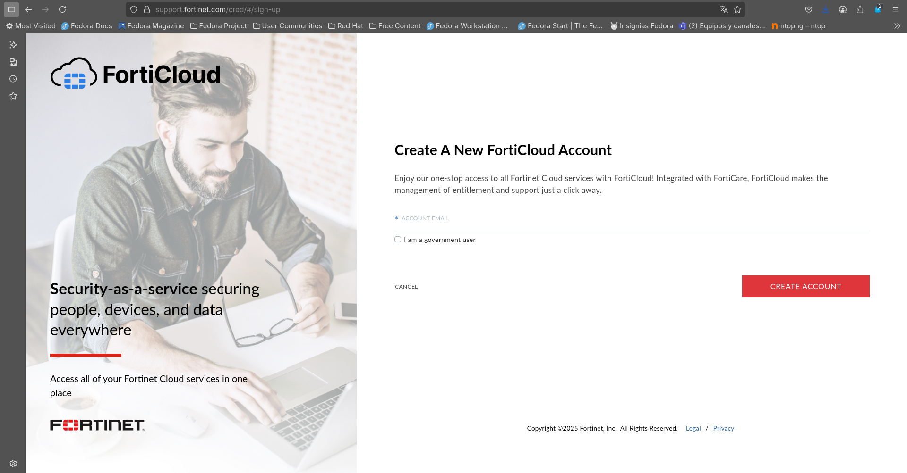
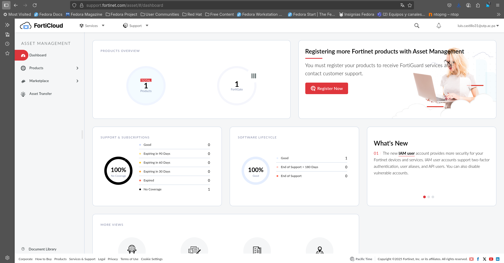
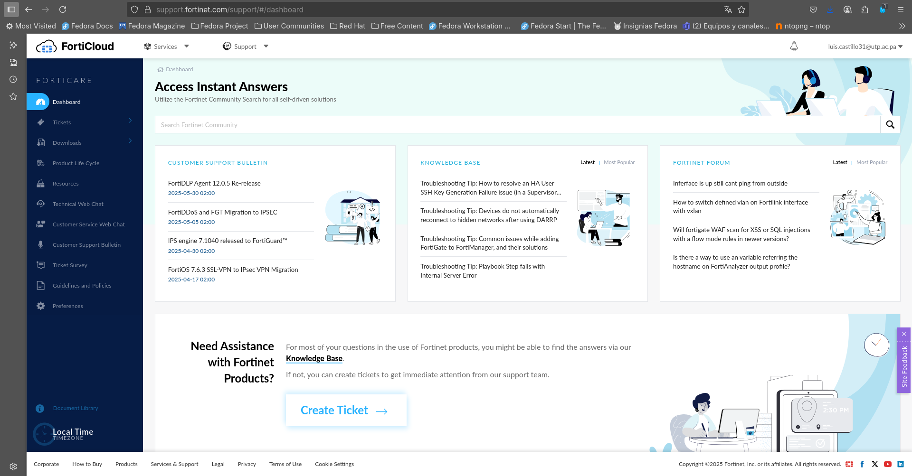

# Instalación de FortiWEB VM en Docker.

## Instalacion de Docker
Comenzamos instalando todas las dependencias de Docker que vayamos a utilizar, en este caso son: 

* docker-cli containerd
* docker-compose
* docker-switch

Para ello, vamos a utilizar los siguientes comandos.

```
sudo dnf install docker-cli containerd
sudo dnf install docker-compose
sudo dnf install docker-switch
```

Verificamos que el servicio se haya instalado correctamente:
```
systemctl status docker
```
Una vez instalado Docker, vamos a descargar la máquina virtual del Fortinet desde su web oficial.
Para ello, vamos a necesitar crear una cuenta en la pagina de [FortiCloud](https://www.forticloud.com/#/).



Registramos nuestra dirección de correo electrónico y culminamos todos los pasos de verificación:


Una vez creada la cuenta, iniciamos sesión con nuestras credenciales y nos debería aparecer un dashboard como este:



Luego nos dirigimos a la página oficial de Fortinet e iniciamos sesión con la cuenta que acabamos de crear. Una vez iniciamos sesión, nos debería redirigir a la página de soporte.




