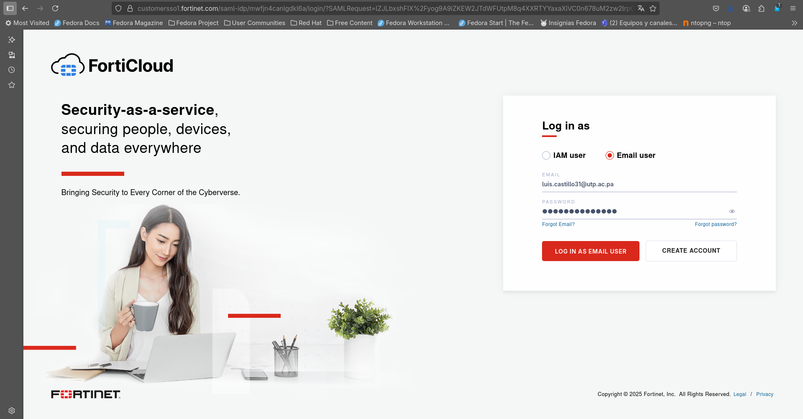

# Instalación de FortiWEB VM en Docker.

## Instalacion de Docker
Comenzamos instalando todas las dependencias de Docker que vayamos a utilizar, en este caso son: 

* docker-cli containerd
* docker-compose
* docker-switch

Para ello, vamos a utilizar los siguientes comandos.

```
sudo dnf install docker-cli containerd
sudo dnf install docker-compose
sudo dnf install docker-switch
```

Verificamos que el servicio se haya instalado correctamente:
```
systemctl status docker
```
Una vez instalado Docker, vamos a descargar la máquina virtual del Fortinet desde su web oficial.
Para ello, vamos a necesitar crear una cuenta en la pagina de [FortiCloud](https://www.forticloud.com/#/).


Registramos nuestra dirección de correo electrónico y culminamos todos los pasos de verificación:



Una vez creada la cuenta, iniciamos sesión con nuestras credenciales y nos debería aparecer un dashboard como este:


Luego nos dirigimos a la página oficial de Fortinet e iniciamos sesión con la cuenta que acabamos de crear. Una vez iniciamos sesión, nos debería redirigir a la página de [soporte](https://support.fortinet.com/support/#/).


Dentro del dashboard buscamos la sección de Downloads y seleccionamos la subsección de máquinas virtuales VM, una vez dentro, vamos a seleccionar la VM del producto que queremos bajar.
En este caso, seleccionamos la opción de FortiGate, luego la plataforma sobre la que vamos a montar la máquina virtual, seleccionamos Docker y desplegamos la ventana de versiones para descargar la más reciente7.6.4.


Vamos a seleccionar la imagen "**New deployment of FortiWeb
FWB_DOCKER-v7.6.4.F-build1062-FORTINET.out.docker.zip (325.23 MB)**" y esperamos que se descargue.


Una vez descargada la imagen de la máquina virtual, vamos a comenzar con el despliegue del contenedor. Para ello, primero debemos descomprimir el archivo .out.docker.zip con el siguiente comando:

```
unzip FWB_DOCKER-v7.6.4.F-build1062-FORTINET.out.docker.zip
```
Luego de descomprimir el archivo con la herramienta **unzip**, nos debería quedar un directorio llamado "**image-docker-64**".
Ahora vamos a acceder a este directorio y vamos a crear la imagen para el contenedor utilizando Docker, donde  el parámetro -t define el nombre de la imagen: 

```
sudo docker build -t fortiweb-image .
```
Nos dirigimos al directorio **script/** donde encontraremos el script de despliegue del contenedor. Para ejecutarlo, debemos indicarle una serie de parámetros que va a requerir el contenedor.
Estos parametros son:
* -i = Específica el nombre de la imagen docker. 
* -n = Específica el nombre del contenedor.
* -e = Asigna una contraseña para la administración del contenedor de FortiWEB por CLI o por GUI.
* -g = Indica el puerto de administración de la máquina FortiWEB por la interfaz GUI.
* -m = Establece un valor total para la memoria del contenedor docker en MB.

```
sudo ./docker-fwb.sh -i fortiweb-image -n fortiweb-docker -e UTP2025 -g 5000 -m 4096
```
Compruebe el estado y la asignación de puertos del contenedor Docker FortiWeb con el siguiente comando:
```
sudo docker container ls
```
Deberia ver una salida de comando como esta:

CONTAINER ID   IMAGE            COMMAND              CREATED        STATUS        PORTS                                                                                                                                                                                                                                      NAMES
container-ID   fortiweb-image   "/bin/docker_init"   fecha de creación   Up 24 hours   0.0.0.0:80->80/tcp, [::]:80->80/tcp, 0.0.0.0:443->443/tcp, [::]:443->443/tcp, 0.0.0.0:5000->8/tcp, [::]:5000->8/tcp, 0.0.0.0:90->9/tcp, [::]:90->9/tcp, 0.0.0.0:8022->22/tcp, [::]:8022->22/tcp, 0.0.0.0:8443->43/tcp, [::]:8443->43/tcp   fortiweb-docker


